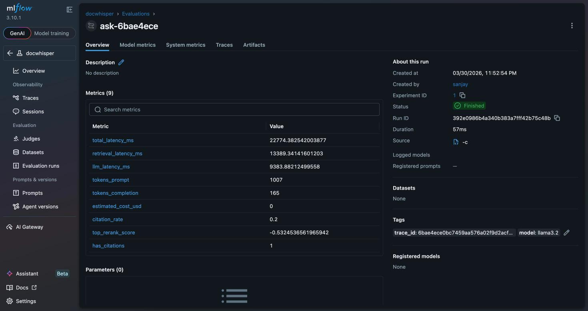

# docwhisper 🔍

> Ask questions about your documents. Get cited answers.

A self-hostable RAG (Retrieval-Augmented Generation) CLI + API that uses **hybrid retrieval** (BM25 + vector search) and **cross-encoder reranking** to find the most relevant chunks before sending them to an LLM. Answers are forced to cite their sources.

```
$ docwhisper ask "What is the return policy?"

━━━━━━━━━━━━━━━━━━━━━━━━━━━━━━━━━━━━━━━━━━━━━━━━━━━━━━━━━━━━
Q: What is the return policy?
━━━━━━━━━━━━━━━━━━━━━━━━━━━━━━━━━━━━━━━━━━━━━━━━━━━━━━━━━━━━

You may return most items within 30 days of delivery [1].
Items must be unused, in original packaging, and include
the original receipt [1]. Refunds are processed within
5–7 business days [2].

── Sources ──────────────────────────────────────────────────
  [1]  docs/returns_policy.md
       "You may return most items within 30 days of the
        delivery date for a full refund..."

  [2]  docs/returns_policy.md
       "Approved refunds are processed within 5–7 business
        days to your original payment method..."
━━━━━━━━━━━━━━━━━━━━━━━━━━━━━━━━━━━━━━━━━━━━━━━━━━━━━━━━━━━━
```

---

## Observability

docwhisper tracks latency, token usage, cost, and citation quality per request. Telemetry is on by default and requires no external service — it always emits structured JSON debug logs. Optionally ship metrics to **MLflow** or **Weights & Biases**.

**MLflow quickstart:**

```bash
pip install -e ".[observability]"
mlflow ui --port 5000 &
export MLFLOW_TRACKING_URI=http://localhost:5000
docwhisper ask "What is the return policy?"
# open http://localhost:5000 — one run logged per query
```


*MLflow run view showing all 9 per-request metrics: latency breakdowns, token counts, estimated cost, citation rate, and rerank score.*

**Live metrics endpoint** (REST server only):

```bash
curl http://localhost:8000/metrics
# {"request_count": 42, "p50_latency_ms": 1240, "p95_latency_ms": 2890, ...}
```

Disable entirely with `DOCWHISPER_TELEMETRY=false`. See [docs/observability.md](docs/observability.md) for the full guide including W&B setup, regression gating, and Docker Compose.

---

## Why this exists

Most RAG tutorials use pure vector search. That's fine for semantic queries but misses exact keyword matches ("what is the Section 4.2 clause?"). BM25 catches those. Combining both, then reranking with a cross-encoder, is what actually works in production.

I built this to have a clean reference implementation I could point people to.

---

## How it works

```
Your docs (.txt / .md / .pdf / .html)
         │
         ▼
    [ Chunker ]   — sliding window, configurable size + overlap
         │
    ┌────┴─────┐
    │          │
[ BM25 ]  [ Vector ]   — run in parallel, top-20 each
    │          │
    └────┬─────┘
         │  merge + deduplicate
         ▼
  [ Cross-Encoder ]    — rerank to top-5
         │
         ▼
      [ LLM ]          — gpt-4o-mini / llama3 / groq / etc.
         │
         ▼
  Answer + Citations
```

---

## Quickstart

### 1. Install

```bash
git clone https://github.com/sanjaychelliah/docwhisper
cd docwhisper
pip install -e .
```

For PDF support:
```bash
pip install -e ".[pdf]"
```

For the REST API:
```bash
pip install -e ".[server]"
```

### 2. Set your API key

```bash
cp .env.example .env
# edit .env and add your OPENAI_API_KEY
export OPENAI_API_KEY=sk-...
```

Works with any OpenAI-compatible API — see [Using other LLMs](#using-other-llms).

### 3. Add your documents

```bash
mkdir docs
cp your_files.md docs/          # .txt, .md, .pdf, .html all work
```

### 4. Index

```bash
docwhisper ingest --docs-dir ./docs
```

This downloads the embedding model on first run (~90MB), encodes all your chunks, and saves the index to `.docwhisper_index/`.

### 5. Ask

```bash
docwhisper ask "What is the cancellation policy?"
docwhisper ask "How do I reset my password?"
```

---

## Python API

```python
from docwhisper.pipeline import DocWhisper

dw = DocWhisper(docs_dir="./docs")
dw.ingest()  # skip if already indexed, use dw.load() instead

answer = dw.ask("What is the refund timeline?")

print(answer.answer)      # the answer text
print(answer.citations)   # list of cited chunks with sources
print(answer.has_citations)  # False if the LLM answered from general knowledge
print(answer.format())    # pretty-printed version
```

If the index already exists, skip re-ingesting:

```python
dw = DocWhisper(docs_dir="./docs")
dw.load()   # load from disk, no re-embedding
answer = dw.ask("...")
```

---

## REST API

```bash
# start the server
uvicorn docwhisper.server:app --reload

# index docs
curl -X POST http://localhost:8000/ingest

# ask a question
curl -X POST http://localhost:8000/ask \
  -H "Content-Type: application/json" \
  -d '{"question": "What is the return window?"}'
```

Response:
```json
{
  "question": "What is the return window?",
  "answer": "You can return items within 30 days [1].",
  "citations": [
    {
      "ref": "[1]",
      "source": "docs/returns_policy.md",
      "excerpt": "You may return most items within 30 days of the delivery date..."
    }
  ],
  "has_citations": true,
  "model": "gpt-4o-mini"
}
```

Swagger docs at `http://localhost:8000/docs`.

---

## Using other LLMs

docwhisper uses the OpenAI client under the hood — just point `OPENAI_API_BASE` at any compatible endpoint.

**Ollama (fully local, free):**
```bash
# install ollama: https://ollama.com
ollama pull llama3.2

export OPENAI_API_BASE=http://localhost:11434/v1
export OPENAI_API_KEY=ollama   # any non-empty string
export DOCWHISPER_LLM_MODEL=llama3.2
docwhisper ask "..."
```

**Groq (fast, cheap):**
```bash
export OPENAI_API_BASE=https://api.groq.com/openai/v1
export OPENAI_API_KEY=gsk_...
export DOCWHISPER_LLM_MODEL=llama-3.3-70b-versatile
```

**Together AI:**
```bash
export OPENAI_API_BASE=https://api.together.xyz/v1
export OPENAI_API_KEY=...
export DOCWHISPER_LLM_MODEL=meta-llama/Llama-3-70b-chat-hf
```

---

## Configuration

All settings can be changed via environment variables or a `.env` file. See `.env.example` for the full list.

| Variable | Default | What it does |
|---|---|---|
| `OPENAI_API_KEY` | — | Your LLM API key |
| `OPENAI_API_BASE` | OpenAI | API endpoint (swap for Ollama/Groq/etc.) |
| `DOCWHISPER_LLM_MODEL` | `gpt-4o-mini` | Model name |
| `DOCWHISPER_DOCS_DIR` | `docs/` | Where your documents live |
| `DOCWHISPER_INDEX_DIR` | `.docwhisper_index` | Where the built index is stored |
| `DOCWHISPER_EMBED_MODEL` | `all-MiniLM-L6-v2` | Sentence-transformers model for embeddings |
| `DOCWHISPER_RERANK_MODEL` | `cross-encoder/ms-marco-MiniLM-L-6-v2` | Cross-encoder for reranking |
| `DOCWHISPER_BM25_TOP_K` | `20` | Candidates from BM25 |
| `DOCWHISPER_VECTOR_TOP_K` | `20` | Candidates from vector search |
| `DOCWHISPER_RERANK_TOP_K` | `5` | Final chunks sent to LLM after reranking |
| `DOCWHISPER_CHUNK_SIZE` | `512` | Words per chunk |
| `DOCWHISPER_CHUNK_OVERLAP` | `64` | Overlap between consecutive chunks |
| `DOCWHISPER_REQUIRE_CITATIONS` | `true` | Warn (and exit 1) if answer has no citations |

---

## Evaluation

There's a simple eval runner that checks citation presence, answer relevance, and whether the right source was retrieved. Useful for catching regressions after you change models or chunk settings.

Create an eval file:

```json
[
  {
    "question": "What is the return window?",
    "expected_keywords": ["30 days", "refund"],
    "expected_source_hint": "returns_policy"
  }
]
```

Run it:

```bash
python -m docwhisper.eval --eval-file eval_questions.json
```

Output:

```
══════════════════════════════════════════════════════════════
  docwhisper eval report
══════════════════════════════════════════════════════════════

  ✓  Q: What is the return window?
      citations : ✓
      relevance : ✓
      source    : ✓

──────────────────────────────────────────────────────────────
  Result: 1/1 cases passed
══════════════════════════════════════════════════════════════
```

The CI pipeline (`.github/workflows/ci.yml`) runs unit tests on every push and runs the eval suite on main when `OPENAI_API_KEY` is available as a repository secret.

---

## Project structure

```
docwhisper/
├── docwhisper/
│   ├── config.py      — all settings, env-var overridable
│   ├── ingest.py      — load docs, chunk, build BM25 + vector index
│   ├── retrieve.py    — hybrid retrieval + cross-encoder reranking
│   ├── answer.py      — LLM call + citation enforcement
│   ├── pipeline.py    — high-level DocWhisper class
│   ├── cli.py         — command-line interface
│   ├── server.py      — FastAPI REST server
│   └── eval.py        — evaluation runner
├── tests/             — pytest unit tests (no LLM needed)
├── examples/
│   ├── sample_docs/   — example markdown docs to try
│   ├── eval_questions.json
│   ├── run_quickstart.py
│   └── use_ollama.py
├── .github/workflows/ci.yml
├── .env.example
└── pyproject.toml
```

---

## Supported file types

| Format | Requires |
|---|---|
| `.txt` | nothing |
| `.md` | nothing |
| `.pdf` | `pip install -e ".[pdf]"` |
| `.html` | `pip install -e ".[html]"` |

---

## Limitations / known issues

- The chunker is word-based, not sentence-aware. It can cut mid-sentence. Good enough for most cases, but if you're indexing structured docs with short dense paragraphs you might want to tune `CHUNK_SIZE` down.
- Vector index is a flat numpy array — no FAISS or HNSW. Fine up to ~50k chunks, starts getting slow beyond that. Adding FAISS is a one-file change if you need it.
- No streaming support yet on the CLI — the full answer comes back at once.
- Eval metrics are naive (keyword overlap, not semantic similarity). Good for smoke tests, not for benchmarking model quality.

---
